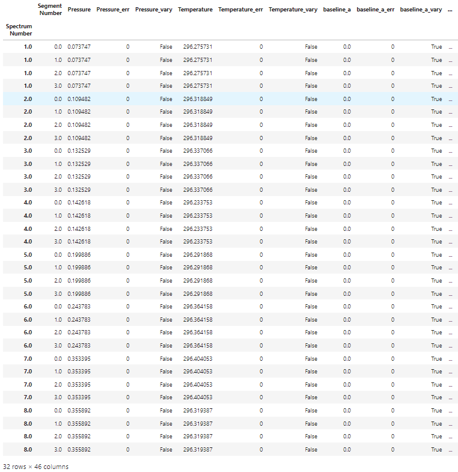

Analysis of ASCENDS Line Spectra
================================

Provided in the MATS v2 release are several examples highlighting MATS capabilities, which can be found in the MATS `examples folder <https://github.com/usnistgov/MATS/tree/master/MATS/Examples>`_. 

The 30012<--00001 CO2 band is frequently used for remote sensing applications, where the R16e line in this band centered at 6359.967 cm-1 is the target line for the ASCENDS - Active Sensing of CO2 Emissions over Nights, Days, and Seasons mission.  This makes this line an important target for spectroscopic reference data and thus a convenient target for single line spectroscopic studies or examples.  

Data originally reported in `Long, D., et al., Frequency-agile, rapid scanning cavity ring-down spectroscopy (FARS-CRDS) measurements of the (30012)←(00001) near-infrared carbon dioxide band. Journal of Quantitative Spectroscopy and Radiative Transfer, 2015. 161: p. 35-40 <https://www.sciencedirect.com/science/article/pii/S0022407315001338>`_.  This example is explicitly referenced in the Adkins and Hodges, Assessment of the precision, bias and numerical correlation of fitted parameters obtained by multi-spectrum fits of the Hartmann-Tran line profile to simulated spectra, JQSRT (under review).

`This example <https://github.com/usnistgov/MATS/tree/master/MATS/Examples/nonHITRAN_Molecules>`_. shows the fitting of real experimental data.  This data has a non-zero baseline and several etalons that need to be considered in order to effectively fit the spectra.  In addition to fitting the experimental spectra, this example also uses simulations to explore the anticipated impact of improving the SNR of the data and increasing the pressure range of the dataset.  

Define Spectra 
++++++++++++++

.. currentmodule:: MATS.spectrum

Module import follows from the :ref:`Fitting Experimental Spectra` and :ref:`Fitting Synthetic Spectra` examples.  The experimental spectra and the linelists are read-in in the same manner as described in the :ref:`Fitting Experimental Spectra` example.  

In this example three etalons are included in the simulation and linear baseine is considered for each spectrum in the dataset.  These fits also make use of the segment column, which allows the spectrum-specific parameters (baseline, etalons) to be treated on smaller segments of the spectrum, opposed to across the whole spectrum. The segment column is set using the segment_column parameter in the :py:class:`Spectrum` definition and is simply the name of a column in the spectrum .csv that contains integers that are common for continuous segments of the spectrum.   This is especially useful for treatment of faster etalons, which may not maintain a consistent phase over entire spectrum.  Additional constraints can be imposed to help with fit convergence and physical modeling. 

.. code:: ipython3

	from MATS.linelistdata import linelistdata
	import MATS.hapi as hapi

	wave_range = 1.5 #range outside of experimental x-range to simulate
	IntensityThreshold = 1e-30 #intensities must be above this value to be simulated
	Fit_Intensity = 1e-23 #intensities must be above this value for the line to be fit
	order_baseline_fit = 1
	tau_column = 'Alpha' # Mean tau/us
	freq_column = 'Wavenumber' # Total Frequency /MHz
	pressure_column = 'Pressure'
	temperature_column = 'Temperature'
	tau_stats_column = None

	PARAM_LINELIST = linelistdata['JQSRT2021_SDNGP_2015']
	PARAM_LINELIST.loc[PARAM_LINELIST['n_delta0_air'].isna(), 'n_delta0_air'] = 0
	etalons = {1:[0.004321,1.168], 2:[0.001377, 59.38], 3:[0.0004578, 29.75]}

	spec_1 = MATS.Spectrum('spectrum_CO2_Air_1%Ar_56Torr_03_formatted_R16e',  molefraction = {2:0.0004254}, natural_abundance = True, diluent = 'air',
									etalons = etalons,
									baseline_order = order_baseline_fit, segment_column = 'Segment',
									input_freq = False, frequency_column = freq_column,
									input_tau = False, tau_column = tau_column, tau_stats_column = tau_stats_column, 
									pressure_column = pressure_column, temperature_column = temperature_column, 
									nominal_temperature = 296, x_shift = 0.00)

	spec_2 = MATS.Spectrum('spectrum_CO2_Air_1%Ar_83Torr_02_formatted_R16e',  molefraction = {2:0.0004254}, natural_abundance = True, diluent = 'air',
									etalons = etalons,
									baseline_order = order_baseline_fit, segment_column = 'Segment',
									input_freq = False, frequency_column = freq_column,
									input_tau = False, tau_column = tau_column, tau_stats_column = tau_stats_column, 
									pressure_column = pressure_column, temperature_column = temperature_column, 
									nominal_temperature = 296, x_shift = 0.00)

	spec_3 = MATS.Spectrum('spectrum_CO2_Air_1%Ar_101Torr_01_formatted_R16e',  molefraction = {2:0.0004254}, natural_abundance = True, diluent = 'air',
									etalons = etalons,
									baseline_order = order_baseline_fit, segment_column = 'Segment',
									input_freq = False, frequency_column = freq_column,
									input_tau = False, tau_column = tau_column, tau_stats_column = tau_stats_column, 
									pressure_column = pressure_column, temperature_column = temperature_column, 
									nominal_temperature = 296, x_shift = 0.00)

	spec_4 = MATS.Spectrum('spectrum_CO2_Air_1%Ar_109Torr_03_formatted_R16e',  molefraction = {2:0.0004254}, natural_abundance = True, diluent = 'air',
									  etalons = etalons,
									baseline_order = order_baseline_fit, segment_column = 'Segment',
									input_freq = False, frequency_column = freq_column,
									input_tau = False, tau_column = tau_column, tau_stats_column = tau_stats_column, 
									pressure_column = pressure_column, temperature_column = temperature_column, 
									nominal_temperature = 296, x_shift = 0.00)

	spec_5 = MATS.Spectrum('spectrum_CO2_Air_1%Ar_152Torr_01_formatted_R16e',  molefraction = {2:0.0004254}, natural_abundance = True, diluent = 'air',
									etalons = etalons,
									baseline_order = order_baseline_fit, segment_column = 'Segment',
									input_freq = False, frequency_column = freq_column,
									input_tau = False, tau_column = tau_column, tau_stats_column = tau_stats_column, 
									pressure_column = pressure_column, temperature_column = temperature_column, 
									nominal_temperature = 296, x_shift = 0.00)

	spec_6 = MATS.Spectrum('spectrum_CO2_Air_1%Ar_186Torr_03_formatted_R16e',  molefraction = {2:0.0004254}, natural_abundance = True, diluent = 'air',
									etalons = etalons,
									baseline_order = order_baseline_fit, segment_column = 'Segment',
									input_freq = False, frequency_column = freq_column,
									input_tau = False, tau_column = tau_column, tau_stats_column = tau_stats_column, 
									pressure_column = pressure_column, temperature_column = temperature_column, 
									nominal_temperature = 296, x_shift = 0.00)

	spec_7 = MATS.Spectrum('spectrum_CO2_Air_1%Ar_269Torr_01_formatted_R16e',  molefraction = {2:0.0004254}, natural_abundance = True, diluent = 'air',
									etalons = etalons,
									baseline_order = order_baseline_fit, segment_column = 'Segment',
									input_freq = False, frequency_column = freq_column,
									input_tau = False, tau_column = tau_column, tau_stats_column = tau_stats_column, 
									pressure_column = pressure_column, temperature_column = temperature_column, 
									nominal_temperature = 296, x_shift = 0.00)

	spec_8 = MATS.Spectrum('spectrum_CO2_Air_1%Ar_271Torr_03_formatted_R16e',  molefraction = {2:0.0004254}, natural_abundance = True, diluent = 'air',
									etalons = etalons,
									baseline_order = order_baseline_fit, segment_column = 'Segment',
									input_freq = False, frequency_column = freq_column,
									input_tau = False, tau_column = tau_column, tau_stats_column = tau_stats_column, 
									pressure_column = pressure_column, temperature_column = temperature_column, 
									nominal_temperature = 296, x_shift = 0.00)

	

Construct Dataset and Generate Fit Parameters
+++++++++++++++++++++++++++++++++++++++++++++
.. currentmodule:: MATS.dataset

The :py:class:`Dataset` object is defined as is outlined in the :ref:`Fitting Experimental Spectra` and :ref:`Fitting Synthetic Spectra` examples.

.. currentmodule:: MATS.generate_fitparam_file

The baseline and parameter fit parameter files are generated using the :py:class:`Generate_FitParam_File` class.  In this example, the line intensity is allowed to float for each spectrum, but all other line shape parameters are constrained to their pressure dependence.  `Long et al.  <https://www.sciencedirect.com/science/article/pii/S0022407315001338>`_ fixed the beyond Voigt SDNGP line shape parameters to those reported by `Lin, H., et al., Cavity ring-down spectrometer for high-fidelity molecular absorption measurements. Journal of Quantitative Spectroscopy and Radiative Transfer, 2015. 161: p. 11-20 <https://www.sciencedirect.com/science/article/pii/S0022407315001284>`_ , while allowing the VP parameters and line mixing to float.  In this example, we are allowing all SDNGP parameters to float using the `Lin et al. values <https://www.sciencedirect.com/science/article/pii/S0022407315001284>`_ as the initial guess, but only considering spectra in the isolated transition pressure regime, where line mixing can be ignored.  

The slope and intercept for the baseline of each spectra are floated, along with the amplitude, period, and phase of each etalon.  Because this example uses the segment function, you can see that each spectrum has 4 segments in the print out of the baseline linelist, so the number of rows in the baseline fit parameter list is four times larger than the number of spectra.  Additional constraints will be added to the etalon parameters in the next section.  

.. code:: ipython3

   SPECTRA = MATS.Dataset([spec_1, spec_2, spec_3, spec_4, spec_5, spec_6, spec_7, spec_8], 'MATS_Example',PARAM_LINELIST)

   #Generate Baseline Parameter list based on number of etalons in spectra definitions and baseline order
   BASE_LINELIST = SPECTRA.generate_baseline_paramlist()

	FITPARAMS = MATS.Generate_FitParam_File(SPECTRA, PARAM_LINELIST, BASE_LINELIST, lineprofile = 'SDNGP', linemixing = False, 
											  fit_intensity = Fit_Intensity, threshold_intensity = IntensityThreshold, sim_window = wave_range,
											  nu_constrain = True, sw_constrain = False, gamma0_constrain = True, delta0_constrain = True, 
											   aw_constrain = True, as_constrain = True, 
											   nuVC_constrain = True, eta_constrain =True, linemixing_constrain = True,
												additional_columns = ['local_lower_quanta'])

	FITPARAMS.generate_fit_param_linelist_from_linelist(vary_nu = {2:{1:True}}, vary_sw = {2:{1:True}},
													 vary_gamma0 = {2:{1: True}},
													 vary_delta0 = {2:{1: True}},
													 vary_aw = {2:{1: True}},
													 vary_as = {2:{1: True}},
													 vary_nuVC = {2:{1:True}},
													 vary_eta = {}, vary_linemixing = {2:{1:False}})
	FITPARAMS.generate_fit_baseline_linelist(vary_baseline = True, vary_molefraction = {2:False}, vary_pressure = False, vary_temperature = False, vary_xshift = False, 
											vary_etalon_amp= True, vary_etalon_period= True, vary_etalon_phase= True)

Fit Spectra
+++++++++++

.. currentmodule:: MATS.fit_dataset

The fitting of the dataset is looped to iterate on the fit results.  The result and residual plots are shown after each iteration (with the first and last iteration shown below).  In the first few iterations not all of the etalons are well modeled leading to systematic residuals, iterating on the best fit results helps better model the etalons minimizing the residuals.

Using the segments in a spectrum, allows us to model the spectrum specific parameters by segment opposed to across the whole spectrum.  However, this flexibility can lead to divergent solutions if additional constraints aren't included.  This example will constrain these parameters using the :py:func:`Fit_DataSet.constrained_baseline` function and by setting constraints directly in the lmfit parameter dictionary.  The :py:func:`Fit_DataSet.constrained_baseline` function indicates the baseline parameters that should be constrained to be equal across the entire spectrum (parameters that won't take advantage of the segment structure).  For this example the baseline and etalon periods are constrained to be equal equal across the entire spectrum.  

This example also sets a few additional constraints on the etalons.  First, the period of each etalon is set to be equal across all spectra in the dataset.  Second, the phase of the first etalon is constrained to be equal across each spectrum.   

.. code:: ipython3

 
	counter = 0
	iterations = 5
	while counter < iterations:
		fit_data = MATS.Fit_DataSet(SPECTRA,'Baseline_LineList', 'Parameter_LineList', minimum_parameter_fit_intensity = Fit_Intensity)
		params = fit_data.generate_params()

		fit_data.constrained_baseline(params, baseline_segment_constrained = True, xshift_segment_constrained = True, molefraction_segment_constrained = True,
											etalon_amp_segment_constrained = False, etalon_period_segment_constrained = True, etalon_phase_segment_constrained = False, 
											pressure_segment_constrained = True, temperature_segment_constrained = True)

		minimum_segment_spec_1 = spec_1.segments.min()

		for param in params:

			if 'etalon_1_period_' in param:
				#Sets the period of etalon_1 to be equal for all spectra
				if param != 'etalon_1_period_1_' + str(int(minimum_segment_spec_1)):
					params[param].set(expr='etalon_1_period_1_' + str(int(minimum_segment_spec_1)))
			if 'etalon_1_phase_' in param:
				#Constrains the phase of etalon_1 across each spectrum
				start_ =  (param.find('_', 9))
				end_ =  (param.find('_', param.find('_', 9) + 1))
				spectrum_number = str(param[start_ + 1:end_])

				if param != 'etalon_1_phase_'+spectrum_number + '_' + str(int(minimum_segment_spec_1)):
					params[param].set(expr= 'etalon_1_phase_'+spectrum_number + '_' + str(int(minimum_segment_spec_1)))

			if 'etalon_2_period_' in param:
				#Sets the period of etalon_1 to be equal for all spectra
				if param != 'etalon_2_period_1_' + str(int(minimum_segment_spec_1)):
					params[param].set(expr='etalon_2_period_1_' + str(int(minimum_segment_spec_1)))

			if 'etalon_3_period_' in param:
				#Sets the period of etalon_1 to be equal for all spectra
				if param != 'etalon_3_period_1_' + str(int(minimum_segment_spec_1)):
					params[param].set(expr='etalon_3_period_1_' + str(int(minimum_segment_spec_1)))

		result = fit_data.fit_data(params, wing_cutoff = 25)
		

		fit_data.residual_analysis(result, indv_resid_plot=False)
		fit_data.update_params(result)
		SPECTRA.generate_summary_file(save_file = True)
		SPECTRA.plot_model_residuals()
		counter+=1
		
		if counter == iterations:
			print (result.params.pretty_print())
			
ITERATION 1

.. image:: example_files/ASCENDS_Iteration_1.png

ITERATION 2

.. image:: example_files/ASCENDS_Iteration_5.png

Compare to Literature
+++++++++++++++++++++
The `Lin et al. <https://www.sciencedirect.com/science/article/pii/S0022407315001284>`_ work reported spectra with QFs between 11000 and 29000 for pressures between 1.33kPa and 26.7kPa.  The current example work was conducted over a slightly higher pressure range of  7.5 to 36 kPa and had QFs of about 1500.

The  `Lin et al. <https://www.sciencedirect.com/science/article/pii/S0022407315001284>`_ work reports uncertainty on the collisional broadening of 0.1%, the pressure shift of 0.35%, the speed-dependent broadening of 0.2%, the speed-dependent shift of 20%, and the Dicke narrowing of 1%.  The code below compares the results from the `Lin et al. <https://www.sciencedirect.com/science/article/pii/S0022407315001284>`_ and current fit example including a plot highlighting the reported relative uncertainty in line shape parameters reported by the fits.  The current example shows much higher fit uncertainties for speed-dependent width and Dicke narrowing, which indicates that at this QF and pressure range the spectra used in this analysis have a difficult time distinguishing between these narrowing mechanisms.  This motivates a Monte Carlo analysis that explores how improving the SNR and pressure range would decrease the uncertainty in the reported line shape parameters.   

 
.. code:: ipython3

	Compare_Results = pd.DataFrame()
	Compare_Results['Parameters'] = ['gamma0_air', 'delta0_air', 'SD_gamma_air', 'SD_delta_air', 'nuVC_air']

	#Get Spectra line number from the parameter results list.  Alternatively, could read in the Linelist file and parse the same way as the initial Parameter linelist
	for param in result.params:
		if ('SD_gamma' in param) and (result.params[param].vary == True):
			line_number = param.replace('SD_gamma_air_line_', '')

	for parameter in Compare_Results['Parameters'].unique():
		# Get Lin et al Parameter values and uncertainties
		Compare_Results.loc[Compare_Results['Parameters'] == parameter, 'Lin et al. Value'] =  PARAM_LINELIST[(PARAM_LINELIST['local_lower_quanta']=='R16e') & (PARAM_LINELIST['global_upper_quanta']==30012)][parameter].values[0]
		lin_reported_uncertainty = {'gamma0_air':0.1, 'delta0_air':0.35, 'SD_gamma_air':0.2, 'SD_delta_air':20, 'nuVC_air':1}
		Compare_Results.loc[Compare_Results['Parameters'] == parameter, 'Lin et al. Uncertainty (%)'] =  lin_reported_uncertainty[parameter]
		
		# Get Parameter results from fitting
		Compare_Results.loc[Compare_Results['Parameters'] == parameter, 'Fit Value'] =  result.params[parameter + '_line_' + line_number].value
		Compare_Results.loc[Compare_Results['Parameters'] == parameter, 'Fit Uncertainty (%)'] =  100*np.abs(result.params[parameter + '_line_' + line_number].stderr / result.params[parameter + '_line_' + line_number].value)

	Compare_Results['Fit Percent Difference (%)'] = 100*(Compare_Results['Fit Value'] - Compare_Results['Lin et al. Value']) / Compare_Results['Fit Value']

	plt.figure(figsize=(8,5))

	plt.semilogy(Compare_Results['Parameters'], Compare_Results['Lin et al. Uncertainty (%)'].values, 'o',label='Lin et al. (2015)')
	plt.semilogy(Compare_Results['Parameters'], Compare_Results['Fit Uncertainty (%)'].values,  'x',label='Current Example')
	ax = plt.gca()
	ax.set_xticklabels(['$\gamma_{0}$', '$\delta_{0}$', '$a_{w}$', '$a_{s}$', '$\\nu_{VC}$' ])
	plt.xlabel('line profile parameter')
	plt.ylabel('Reported Fit Uncertainty (%)')

	#plt.bar(Compare_Results['Parameters'], Compare_Results['Lin et al. Percent Difference (%)'])
	#plt.errorbar(Compare_Results['Parameters'], Compare_Results['Lin et al. Percent Difference (%)'], yerr=Compare_Results['Lin et al. Uncertainty (%)'], fmt="o", color="r")

	plt.show()

	Compare_Results
	

.. image:: example_files/ASCENDS_FitUncertaintyComparison.png	

	
Monte Carlo Analysis
++++++++++++++++++++

The Monte Carlo uncertainty analysis involves running numerous iterations fitting synthetic spectra at experimental conditions.  To simplify the analysis the simulation line list only includes the R16e line and will use the results of the experimental fits as the simulation values.  

.. code:: ipython3

	# Generate linelist only using the R16e line and using the results from the experimental fits
	SIMULATION_LINELIST = PARAM_LINELIST[(PARAM_LINELIST['local_lower_quanta']=='R16e') & (PARAM_LINELIST['global_upper_quanta']==30012)].copy()
	SIMULATION_LINELIST.reset_index(inplace = True)

	SIMULATION_LINELIST.loc[SIMULATION_LINELIST.index ==0, 'gamma0_air'] = result.params['gamma0_air_line_' + line_number].value
	SIMULATION_LINELIST.loc[SIMULATION_LINELIST.index == 0, 'delta0_air'] = result.params['delta0_air_line_' + line_number].value
	SIMULATION_LINELIST.loc[SIMULATION_LINELIST.index == 0, 'nuVC_air'] = result.params['nuVC_air_line_' + line_number].value
	SIMULATION_LINELIST.loc[SIMULATION_LINELIST.index == 0, 'SD_gamma_air'] = result.params['SD_gamma_air_line_' + line_number].value
	SIMULATION_LINELIST.loc[SIMULATION_LINELIST.index == 0, 'SD_delta_air'] = result.params['SD_delta_air_line_' + line_number].value
	SIMULATION_LINELIST.loc[SIMULATION_LINELIST.index == 0, 'y_air_296'] = 0
	SIMULATION_LINELIST['nuVC_air']
	
Additionally, a dataframe summarizing the pressures and SNR (approximated by the QF from fits to the experimental spectra) are necessary for defining the simulation conditions.  In this analysis we are comparing the synthetic results at experimetnal conditions, to those with three addtional low pressure spectra and with SNR of 5000 (about three times larger than observed in the experimental spectra).

.. code:: ipython3

	# Pressure and QF of Fit Results for Simulation at Experiment Conditions
	Exp_Simulation_conditions = pd.DataFrame()
	Exp_Simulation_conditions['Spectrum Number'] = SPECTRA.get_list_spectrum_numbers()
	for spec in SPECTRA.spectra:
		Exp_Simulation_conditions.loc[Exp_Simulation_conditions['Spectrum Number']==spec.spectrum_number,'SNR']=spec.calculate_QF()
		Exp_Simulation_conditions.loc[Exp_Simulation_conditions['Spectrum Number']==spec.spectrum_number,'Pressures']= np.around(spec.get_pressure_torr())
		
	New_Simulation_conditions = Exp_Simulation_conditions.copy()
	New_Simulation_conditions['SNR'] = 5000
	new_pressures = pd.DataFrame(data = {'Pressures' : [5, 10, 25], 'SNR': [5000, 5000, 5000]})
	New_Simulation_conditions = New_Simulation_conditions.append(new_pressures)
	
In the Monte Carlo simulation the inital guesses will be perturbed from the simulation value by the uncertainty reported in the experimental fit.  

.. code:: ipython3

	gamma0_err = Compare_Results[Compare_Results['Parameters'] == 'gamma0_air']['Fit Uncertainty (%)'].values[0]/100 #per
	delta0_err = Compare_Results[Compare_Results['Parameters'] == 'delta0_air']['Fit Uncertainty (%)'].values[0]/100 #per
	aw_err = Compare_Results[Compare_Results['Parameters'] == 'SD_gamma_air']['Fit Uncertainty (%)'].values[0]/100#per
	as_err = Compare_Results[Compare_Results['Parameters'] == 'SD_delta_air']['Fit Uncertainty (%)'].values[0]/100 #per
	nuVC_err = Compare_Results[Compare_Results['Parameters'] == 'nuVC_air']['Fit Uncertainty (%)'].values[0]/100 #per
	
We define a function to generate spectrum based on the input simulation conditions (SNR and pressure) and with a given input linelist.
	
.. code:: ipython3

	def gen_spec(simulation_conditions, i, simulation_linelist):
		sample_molefraction =  {2:0.0004254}
		wave_min = 6358.972 #cm-1
		wave_max = 6360.963 #cm-1
		wave_space = 0.006772 #cm-1
		wave_error = 4.67e-7
		
		etalons = {1:[0.004321,1.168], 2:[0.001377, 59.38], 3:[0.0004578, 29.75]}

		spec = MATS.simulate_spectrum(simulation_linelist, 
								 baseline_terms = [0,0],
								wave_min = wave_min, wave_max = wave_max,  wave_space = wave_space, wave_error = wave_error,
								SNR = simulation_conditions['SNR'].values[i], etalons = etalons, 
								temperature = 23.25,
								pressure = simulation_conditions['Pressures'].values[i], 
								wing_cutoff = 25,  wing_method = 'wing_cutoff', 
								filename = str(int(simulation_conditions['Pressures'].values[i])) + 'torr', 
								molefraction = sample_molefraction, 
								natural_abundance = True, nominal_temperature = 296, IntensityThreshold = 1e-30, num_segments = 1)
		return spec
	
The mc_ function defined below simply takes the simulation conditions and number of iterations as inputs.  Spectra are simulated at the conditions outlined in the simulation condition dataframe for just the R16e line using the linelist determined from the fits to the experimental spectra.  Again, the inital guesses for the fitting are perturbed randomly at the magnitude of the reported fit error of the fits to the experimental data.  The fits are conducted in the same manner as those to the experimental data without the use of the segment function.  Results from each iteration are saved to a MC_result .csv file.  

.. code:: ipython3

	def mc_(iterations, simulation_conditions, MC_result_file):
		'''
		Runs the MC simulation for given number of iterations using the pressures and SNR defined in simulation condition dataframe for the R16e line and saves results to file
		'''
		MC_Results = pd.DataFrame()
		MC_Results['Iterations'] = np.arange(0, iterations)
		MC_Results['gamma0_air'] = SIMULATION_LINELIST['gamma0_air'].values[0]
		MC_Results['delta0_air'] = SIMULATION_LINELIST['delta0_air'].values[0]
		MC_Results['SD_gamma_air'] = SIMULATION_LINELIST['SD_gamma_air'].values[0]
		MC_Results['SD_delta_air'] = SIMULATION_LINELIST['SD_delta_air'].values[0]
		MC_Results['nuVC_air'] = SIMULATION_LINELIST['nuVC_air'].values[0]
		MC_Results['y_air_296'] = SIMULATION_LINELIST['y_air_296'].values[0]

		for iteration in np.arange(0, iterations):

			#Read in Possible linelists
			PARAM_LINELIST = SIMULATION_LINELIST.copy()

			if len(simulation_conditions) ==8:
				spec_1 = gen_spec(simulation_conditions, 0, SIMULATION_LINELIST)
				spec_2 = gen_spec(simulation_conditions, 1, SIMULATION_LINELIST)
				spec_3 = gen_spec(simulation_conditions, 2, SIMULATION_LINELIST)
				spec_4 = gen_spec(simulation_conditions, 3, SIMULATION_LINELIST)
				spec_5 = gen_spec(simulation_conditions, 4, SIMULATION_LINELIST)
				spec_6 = gen_spec(simulation_conditions, 5, SIMULATION_LINELIST)
				spec_7 = gen_spec(simulation_conditions, 6, SIMULATION_LINELIST)
				spec_8 = gen_spec(simulation_conditions, 7, SIMULATION_LINELIST)
				SPECTRA = MATS.Dataset([spec_1, spec_2, spec_3, spec_4, spec_5, spec_6, spec_7, spec_8], 'Monte Carlo Analysis',PARAM_LINELIST) 
			elif len(simulation_conditions) == 11:
				spec_1 = gen_spec(simulation_conditions, 0, SIMULATION_LINELIST)
				spec_2 = gen_spec(simulation_conditions, 1, SIMULATION_LINELIST)
				spec_3 = gen_spec(simulation_conditions, 2, SIMULATION_LINELIST)
				spec_4 = gen_spec(simulation_conditions, 3, SIMULATION_LINELIST)
				spec_5 = gen_spec(simulation_conditions, 4, SIMULATION_LINELIST)
				spec_6 = gen_spec(simulation_conditions, 5, SIMULATION_LINELIST)
				spec_7 = gen_spec(simulation_conditions, 6, SIMULATION_LINELIST)
				spec_8 = gen_spec(simulation_conditions, 7, SIMULATION_LINELIST)
				spec_9 = gen_spec(simulation_conditions, 8, SIMULATION_LINELIST)
				spec_10 = gen_spec(simulation_conditions, 9, SIMULATION_LINELIST)
				spec_11 = gen_spec(simulation_conditions, 10, SIMULATION_LINELIST)
				SPECTRA = MATS.Dataset([spec_1, spec_2, spec_3, spec_4, spec_5, spec_6, spec_7, spec_8, spec_9, spec_10, spec_11], 'Monte Carlo Analysis',PARAM_LINELIST) 
			

		
				

			#Generate Baseline Parameter list based on number of etalons in spectra definitions and baseline order
			BASE_LINELIST = SPECTRA.generate_baseline_paramlist()
			
			
			gamma0_err = Compare_Results[Compare_Results['Parameters'] == 'gamma0_air']['Fit Uncertainty (%)'].values[0]/100 #per
			delta0_err = Compare_Results[Compare_Results['Parameters'] == 'delta0_air']['Fit Uncertainty (%)'].values[0]/100 #per
			aw_err = Compare_Results[Compare_Results['Parameters'] == 'SD_gamma_air']['Fit Uncertainty (%)'].values[0]/100#per
			as_err = Compare_Results[Compare_Results['Parameters'] == 'SD_delta_air']['Fit Uncertainty (%)'].values[0]/100 #per
			nuVC_err = Compare_Results[Compare_Results['Parameters'] == 'nuVC_air']['Fit Uncertainty (%)'].values[0]/100 #per
			

			PARAM_LINELIST.loc[PARAM_LINELIST['molec_id'] == 2, 'gamma0_air'] = PARAM_LINELIST[PARAM_LINELIST['molec_id']==2]['gamma0_air'].values*(1 + np.random.normal(loc = 0, scale =1, size = len(PARAM_LINELIST[PARAM_LINELIST['molec_id']==2]['sw']))*gamma0_err)
			PARAM_LINELIST.loc[PARAM_LINELIST['molec_id'] == 2, 'delta0_air'] = PARAM_LINELIST[PARAM_LINELIST['molec_id']==2]['delta0_air'].values*(1 + np.random.normal(loc = 0, scale =1, size = len(PARAM_LINELIST[PARAM_LINELIST['molec_id']==2]['sw']))*delta0_err)
			PARAM_LINELIST.loc[PARAM_LINELIST['molec_id'] == 2, 'SD_gamma_air'] = PARAM_LINELIST[PARAM_LINELIST['molec_id']==2]['SD_gamma_air'].values*(1 + np.random.normal(loc = 0, scale =1, size = len(PARAM_LINELIST[PARAM_LINELIST['molec_id']==2]['sw']))*aw_err)
			PARAM_LINELIST.loc[PARAM_LINELIST['molec_id'] == 2, 'SD_delta_air'] = PARAM_LINELIST[PARAM_LINELIST['molec_id']==2]['SD_delta_air'].values*(1 + np.random.normal(loc = 0, scale =1, size = len(PARAM_LINELIST[PARAM_LINELIST['molec_id']==2]['sw']))*as_err)
			PARAM_LINELIST.loc[PARAM_LINELIST['molec_id'] == 2, 'nuVC_air'] = PARAM_LINELIST[PARAM_LINELIST['molec_id']==2]['nuVC_air'].values*(1 + np.random.normal(loc = 0, scale =1, size = len(PARAM_LINELIST[PARAM_LINELIST['molec_id']==2]['sw']))*nuVC_err)

			FITPARAMS = MATS.Generate_FitParam_File(SPECTRA, PARAM_LINELIST, BASE_LINELIST, lineprofile = 'SDNGP', linemixing = False, 
													  fit_intensity = Fit_Intensity, threshold_intensity = IntensityThreshold, sim_window = wave_range,
													  nu_constrain = True, sw_constrain = False, gamma0_constrain = True, delta0_constrain = True, 
													   aw_constrain = True, as_constrain = True, 
													   nuVC_constrain = True, eta_constrain =True, linemixing_constrain = True,
														additional_columns = ['local_lower_quanta'])

			FITPARAMS.generate_fit_param_linelist_from_linelist(vary_nu = {2:{1:True}}, vary_sw = {2:{1:True}},
															 vary_gamma0 = {2:{1: True}},
															 vary_delta0 = {2:{1: True}},
															 vary_aw = {2:{1: True}},
															 vary_as = {2:{1: True}},
															 vary_nuVC = {2:{1:True}},
															 vary_eta = {}, vary_linemixing = {2:{1:False}})
			FITPARAMS.generate_fit_baseline_linelist(vary_baseline = True, vary_molefraction = {2:False}, vary_pressure = False, vary_temperature = False, vary_xshift = False, 
													vary_etalon_amp= True, vary_etalon_period= True, vary_etalon_phase= True)

			fit_data = MATS.Fit_DataSet(SPECTRA,'Baseline_LineList', 'Parameter_LineList', minimum_parameter_fit_intensity = Fit_Intensity)
			params = fit_data.generate_params()

			result = fit_data.fit_data(params, wing_cutoff = 25)

			fit_data.residual_analysis(result, indv_resid_plot=False)
			fit_data.update_params(result)
			#SPECTRA.generate_summary_file(save_file = True)
			#SPECTRA.plot_model_residuals()

			
			#line Shape Parameters
			MC_Results.loc[MC_Results['Iterations']== iteration, 'gamma0_air_fit'] =result.params['gamma0_air_line_0'].value
			MC_Results.loc[MC_Results['Iterations']== iteration, 'gamma0_air_fit_err'] =result.params['gamma0_air_line_0'].stderr
			MC_Results.loc[MC_Results['Iterations']== iteration, 'delta0_air_fit'] = result.params['delta0_air_line_0'].value
			MC_Results.loc[MC_Results['Iterations']== iteration, 'delta0_air_fit_err'] = result.params['delta0_air_line_0'].stderr
			MC_Results.loc[MC_Results['Iterations']== iteration, 'nuVC_air_fit'] = result.params['nuVC_air_line_0'].value
			MC_Results.loc[MC_Results['Iterations']== iteration, 'nuVC_air_fit_err'] = result.params['nuVC_air_line_0'].stderr
			MC_Results.loc[MC_Results['Iterations']== iteration, 'SD_gamma_air_fit'] =result.params['SD_gamma_air_line_0'].value
			MC_Results.loc[MC_Results['Iterations']== iteration, 'SD_gamma_air_fit_err'] =result.params['SD_gamma_air_line_0'].stderr
			MC_Results.loc[MC_Results['Iterations']== iteration, 'SD_delta_air_fit'] =result.params['SD_delta_air_line_0'].value
			MC_Results.loc[MC_Results['Iterations']== iteration, 'SD_delta_air_fit_err'] =result.params['SD_delta_air_line_0'].stderr

			MC_Results.loc[MC_Results['Iterations']== iteration, 'QF_1'] = spec_1.calculate_QF()
			MC_Results.loc[MC_Results['Iterations']== iteration, 'QF_2'] = spec_2.calculate_QF()
			MC_Results.loc[MC_Results['Iterations']== iteration, 'QF_3'] = spec_3.calculate_QF()
			MC_Results.loc[MC_Results['Iterations']== iteration, 'QF_4'] = spec_4.calculate_QF()
			MC_Results.loc[MC_Results['Iterations']== iteration, 'QF_5'] = spec_5.calculate_QF()
			MC_Results.loc[MC_Results['Iterations']== iteration, 'QF_6'] = spec_6.calculate_QF()
			MC_Results.loc[MC_Results['Iterations']== iteration, 'QF_7'] = spec_7.calculate_QF()
			MC_Results.loc[MC_Results['Iterations']== iteration, 'QF_8'] = spec_8.calculate_QF()
			if len(simulation_conditions) == 11:
				MC_Results.loc[MC_Results['Iterations']== iteration, 'QF_9'] = spec_9.calculate_QF()
				MC_Results.loc[MC_Results['Iterations']== iteration, 'QF_10'] = spec_10.calculate_QF()
				MC_Results.loc[MC_Results['Iterations']== iteration, 'QF_11'] = spec_11.calculate_QF()
				

			MC_Results.to_csv(MC_result_file + '.csv', index = False)

Below are the calls to the mc_ function at the experimental and new simulation conditions, which will generate and fit 50 iterations of synthetic data for each case. 
			
.. code:: ipython3

	mc_(50, Exp_Simulation_conditions, 'Experimental_Conditions_MC')
	mc_(50, New_Simulation_conditions, 'New_Conditions_MC')
        

The parameter_eval function summarizes the MC results comparing the fit average and standard deviation across the iterations to the reported fit uncertainty on each iteration.  This also calculates the fractional error compared to the simulation value.  Plots of summary and dataframe are generated for visualization.

.. code:: ipython3

	def parameter_eval(df, report_df):
		'''
		Summarizes MC results for a given parameter
		'''
		params = ['gamma0_air', 'delta0_air', 'SD_gamma_air', 'SD_delta_air', 'nuVC_air']
		fig = plt.figure(constrained_layout=True, figsize = [20,3])
		spec = gridspec.GridSpec(ncols=5, nrows=1, figure=fig)
		ax1 = fig.add_subplot(spec[0, 0])
		ax2 = fig.add_subplot(spec[0,1])
		ax3 = fig.add_subplot(spec[0,2])
		ax4 = fig.add_subplot(spec[0,3])
		ax5 = fig.add_subplot(spec[0,4])
		
		axes = [ax1, ax2, ax3, ax4, ax5]
		count =0
		for simulated_column in params:
			param_avg = df[simulated_column + '_fit'].median()
			param_std = df[simulated_column + '_fit'].std()
			param_err_avg = df[simulated_column + '_fit_err'].median()

			if df[simulated_column].values[0] == 0:
				param_frac_err = 0
				param_fit_err = 0
			else:
				param_frac_err = 100*(param_avg - df[simulated_column].values[0]) / df[simulated_column].values[0]
				param_fit_err = np.abs(100*param_std / param_avg)
			if param_err_avg == 0:
				param_err_ratio = 0
			else:
				param_err_ratio = param_std/param_err_avg

			report_df.loc[report_df['Reported Values']==simulated_column, 'Simulated Value'] = df[simulated_column].values[0]
			report_df.loc[report_df['Reported Values']==simulated_column, 'Parameter Fit Average'] = param_avg
			report_df.loc[report_df['Reported Values']==simulated_column, 'Parameter Fit StDev'] = param_std
			report_df.loc[report_df['Reported Values']==simulated_column, 'Parameter Error Average'] = param_err_avg 
			report_df.loc[report_df['Reported Values']==simulated_column, 'Parameter Fractional Error'] = param_frac_err
			report_df.loc[report_df['Reported Values']==simulated_column, 'Parameter Fit Error'] = param_fit_err
			report_df.loc[report_df['Reported Values']==simulated_column, 'Error Ratio'] = param_err_ratio
			
			ax = axes[count]
			ax.errorbar(df['Iterations'], df[simulated_column + '_fit'], fmt = 'o', yerr = df[simulated_column + '_fit_err'])
			ax.hlines(param_avg, 0, 50)
			ax.hlines(param_avg + param_std, 0, 50, linestyles = 'dashed')
			ax.hlines(param_avg - param_std, 0, 50, linestyles = 'dashed')
			ax.hlines(df[simulated_column].values[0], 0, 50, linestyles = 'dashed', colors = 'r')
			ax.set_title(simulated_column)
			ax.set_xlabel('interations')
			
			ax.ticklabel_format(useOffset=False)
			count+=1
		ax1.set_ylabel('Parameter Value')

		plt.show()
		
		return report_df

The Experimental parameter result table shows good agreement in the fit uncertainty reported in the experimental data and averaged over the iterations of the MC analysis conducted at experimental conditions.  This also provides a measure of the ratio between the standard deviations in the fit values across the iterations compared to the average fit uncertainty.  Ratios greater than one indicate that the fit uncertainty reported by one iteration might under represent the uncertainty, most likely because of correlation between parameters that aren't included in the calculation of the fit uncertainty.  This ratio, when greater than one, could act as a correction factor to increase the experiment fit uncertainty.

.. code:: ipython3

	exp_MC = pd.read_csv('Experimental_Conditions_MC.csv')
	new_MC = pd.read_csv('New_Conditions_MC.csv')

	EXP_SUMMARY = pd.DataFrame()
	EXP_SUMMARY['Reported Values'] = ['gamma0_air', 'delta0_air', 'SD_gamma_air', 'SD_delta_air', 'nuVC_air']
	EXP_SUMMARY['Simulated Value'] = 0
	EXP_SUMMARY['Parameter Fit Average'] = 0
	EXP_SUMMARY['Parameter Fit StDev'] = 0
	EXP_SUMMARY['Parameter Fractional Error'] = 0
	EXP_SUMMARY['Parameter Fit Error'] = 0
	EXP_SUMMARY['Error Ratio'] = 0

	NEW_SUMMARY = EXP_SUMMARY.copy()

	EXP_SUMMARY = parameter_eval(exp_MC, EXP_SUMMARY)
	EXP_SUMMARY
	
.. image:: example_files/ASCENDS_MC_Exp.png	

.. image:: example_files/ASCENDS_MC_Exp_Summary.png	

By comparing the average fit uncertainties over MC simulations in the new conditions (higher SNR and 3 extra pressures) to the experimental conditions indicate that the proposed improvements to the experiments can be expected to reduce the uncertainties in the spectroscopic parameters by factors of 2.8 to 3.7.  The largest improvement would be to the Dicke narrowing parameter, which is aided by not only the higher SNR, but also by the inclusion of additional low-pressure spectra that fall in a domain where the Dicke narrowing mechanism dominates over the speed-dependent narrowing.  

	
.. code:: ipython3

	NEW_SUMMARY= parameter_eval(new_MC, NEW_SUMMARY)
	NEW_SUMMARY['Improvement Over Experiment'] = EXP_SUMMARY['Parameter Fit Error'].values/NEW_SUMMARY['Parameter Fit Error'].values
	NEW_SUMMARY

.. image:: example_files/ASCENDS_MC_New.png	

.. image:: example_files/ASCENDS_MC_New_Summary.png	