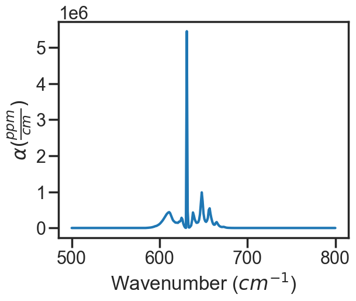

HITRAN Line-by-Line Static Molecules
====================================

Provided in the MATS are several examples highlighting MATS capabilities, which can be found in the MATS `examples folder <https://github.com/usnistgov/MATS/tree/master/Examples>`_. 

MATS has added the capability to simulate and/or fit spectra of molecules that only available in HITRAN as static molecules (not in the typical HITRANOnline) format.  

`The example below ptovides an example of how to simulate spectra using static HITRAN LBL data and is based on the code provided in the HITRAN static LBL molecule example. <https://github.com/usnistgov/MATS/tree/master/Examples/HITRAN_static_LBL_molecules>`_   

Generating a MATS linelist from a .par file
+++++++++++++++++++++++++++++++++++++++++++

The .par formatting is provided in Table 1 of the HITRAN 2004 paper.  The code below uses that .par formatting to parse the spectra into the MATS format.

L.S. Rothman, D. Jacquemart, A. Barbe, D. Chris Benner, M. Birk, L.R. Brown, M.R. Carleer, C. Chackerian, K. Chance, L.H. Coudert, V. Dana, V.M. Devi, J.-M. Flaud, R.R. Gamache, A. Goldman, J.-M. Hartmann, K.W. Jucks, A.G. Maki, J.-Y. Mandin, S.T. Massie, J. Orphal, A. Perrin, C.P. Rinsland, M.A.H. Smith, J. Tennyson, R.N. Tolchenov, R.A. Toth, J. Vander Auwera, P. Varanasi, G. Wagner, The HITRAN 2004 molecular spectroscopic database, Journal of Quantitative Spectroscopy and Radiative Transfer, Volume 96, Issue 2, 2005, Pages 139-204, https://doi.org/10.1016/j.jqsrt.2004.10.008

Users will need to download the .par file provided by HITRAN for desired molecule.

This example uses CF4 and a portion of the HITRAN provided .par file. The entire HITRAN .par file can be used (and has been tested locally), but is above the github file storage recommendation.

.. code:: ipython3

	molecule = 'CF4'

	filename = '42_hit20_500_800.par'

	PARAM_LINELIST = pd.DataFrame()
	with open(filename) as file:
		PARAM_LINELIST['molec_id'] = [int(line[0:2]) for line in file]
	with open(filename) as file:
		PARAM_LINELIST['local_iso_id'] = [int(line[2:3]) for line in file]
	with open(filename) as file:
		PARAM_LINELIST['nu'] = [float(line[3:15]) for line in file]
	with open(filename) as file:
		PARAM_LINELIST['sw'] = [float(line[15:25]) for line in file]
	with open(filename) as file:
		PARAM_LINELIST['elower'] = [ float(line[45:55]) for line in file]
	with open(filename) as file:
		PARAM_LINELIST['gamma0_air'] = [ float(line[35:40]) for line in file]
	with open(filename) as file:
		PARAM_LINELIST['n_gamma0_air'] = [ float(line[55:59]) for line in file]
	with open(filename) as file:
		PARAM_LINELIST['delta0_air'] = [ float(line[59:67]) for line in file]
	with open(filename) as file:
		PARAM_LINELIST['gamma0_self'] = [ float(line[40:45]) for line in file]

		

	PARAM_LINELIST['delta0_self'] = PARAM_LINELIST['delta0_air'].values
	PARAM_LINELIST['n_gamma0_self'] = PARAM_LINELIST['n_gamma0_air'].values
	PARAM_LINELIST['n_delta0_air'] = 0
	PARAM_LINELIST['n_delta0_self'] = 0
	PARAM_LINELIST['SD_gamma_air'] = 0
	PARAM_LINELIST['SD_gamma_self'] = 0
	PARAM_LINELIST['n_gamma2_air'] = PARAM_LINELIST['n_gamma0_air'].values
	PARAM_LINELIST['n_gamma2_self'] = PARAM_LINELIST['n_gamma0_self'].values
	PARAM_LINELIST['SD_delta_air'] = 0
	PARAM_LINELIST['SD_delta_self'] = 0
	PARAM_LINELIST['n_delta2_air'] = 0
	PARAM_LINELIST['n_delta2_self'] = 0
	PARAM_LINELIST['nuVC_air'] = 0
	PARAM_LINELIST['nuVC_self'] = 0
	PARAM_LINELIST['n_nuVC_air'] = 1
	PARAM_LINELIST['n_nuVC_self'] = 1
	PARAM_LINELIST['eta_air'] = 0
	PARAM_LINELIST['eta_self'] = 0
	PARAM_LINELIST['y_air'] = 0
	PARAM_LINELIST['y_self'] = 0
	PARAM_LINELIST['n_y_air'] = 1 #used in MATS versions 3 (current development version) and higher 
	PARAM_LINELIST['n_y_self'] = 1#used in MATS versions 3 (current development version) and higher 

	PARAM_LINELIST = PARAM_LINELIST[['molec_id', 'local_iso_id', 'nu', 'elower', 'sw', 
									'gamma0_air', 'n_gamma0_air', 'delta0_air', 'n_delta0_air', 
									'SD_gamma_air', 'n_gamma2_air', 'SD_delta_air', 'n_delta2_air', 
									'nuVC_air', 'n_nuVC_air', 'eta_air', 'y_air', 'n_y_air', 
									'gamma0_self', 'n_gamma0_self', 'delta0_self', 'n_delta0_self', 
									'SD_gamma_self', 'n_gamma2_self', 'SD_delta_self', 'n_delta2_self', 
									'nuVC_self', 'n_nuVC_self', 'eta_self', 'y_self', 'n_y_self',]]
	PARAM_LINELIST.sort_values(by = ['nu'], inplace = True)
	#PARAM_LINELIST.to_csv(molecule + '_ParameterLinelist.csv', index = False) #Can save to .csv file, but it is a large file, so you might want to truncate before saving
	
	plt.figure(figsize=(8, 6))
	plt.stem(PARAM_LINELIST['nu'], PARAM_LINELIST['sw'], use_line_collection = True, markerfmt = " ")
	plt.yscale('log')
	plt.xlabel('Wavenumber (cm$^{-1}$)')
	plt.ylabel('Line Intensity \n (cm$^{-1}$ / (molecule $\cdot$ cm$^{-2}$))')
	
.. image:: example_files/HITRAN_static_LBL.png

TIPS Availability
+++++++++++++++++
While these molecules are available in HITRAN, the molecules available in the TIPS-2011 and TIPS-2017 partition function libraries differ. For example in hapi TIPS-2011 has information for CF4, where TIPS-2017 is an array of zeros. This leads to nan values for the at simulation temperature line intensities. We added the MATS capability to switch from the default TIPS-2017 to TIPS-2011, so that this molecule could be appropriately simulated. Below is a summary of molecules, where this might be an issue. For molecules with no TIPS available the TIPS call with through an error and the 296 line intensity will be used.

TIPS 2011 Only

SO3, M = 46, I =1
CF4, M = 42, I = 1
No TIPS data

HNO3, M = 12, I = 2
HF, M = 14, I = 2
HCl, M = 15, I = 3, 4
HBr, M = 16, I = 3, 4
HI, M = 17, I = 2
N2, M = 22, I = 2
COF2, M = 29, I = 2
O, M = 34, I = 1
CH3OH, M = 38, I=1

Simulating in MATS
++++++++++++++++++

Once the MATS linelist file has been generated spectra can be simulated or fit in MATS as normal. 

.. code:: ipython3

	#PARAM_LINELIST = pd.read_csv('CF4_ParameterLinelist.csv') # Option to read in so you don't have to generate the file every time

	wave_range = 1.5 #range outside of experimental x-range to simulate
	IntensityThreshold = 1e-30 #intensities must be above this value to be simulated
	Fit_Intensity = 1e-24 #intensities must be above this value for the line to be fit
	order_baseline_fit = 1
	baseline_terms = [0] #polynomial baseline coefficients where the index is equal to the coefficient order

	sample_molefraction = {42 :1} #The number here is the molec_id number can be found https://hitran.org/docs/iso-meta/
	wave_min = 500 #cm-1
	wave_max = 800 #cm-1
	wave_space = 1 #cm-1
	SNR = None #if None, then infinite SNR
	temperature = 22.85 # celsius
	pressure = 760 #torr
	spectrum_filename = 'Simulate_CF4'

	spec_1 =  MATS.simulate_spectrum(PARAM_LINELIST, wave_min = wave_min, wave_max = wave_max, wave_space = wave_space, 
							SNR = SNR, baseline_terms = baseline_terms, temperature = temperature, pressure = pressure, 
							wing_cutoff = 5,  wing_method = 'wing_cutoff', 
							filename = spectrum_filename, molefraction = sample_molefraction,TIPS = PYTIPS2011)

	spec_1.plot_wave_alpha()

								   			