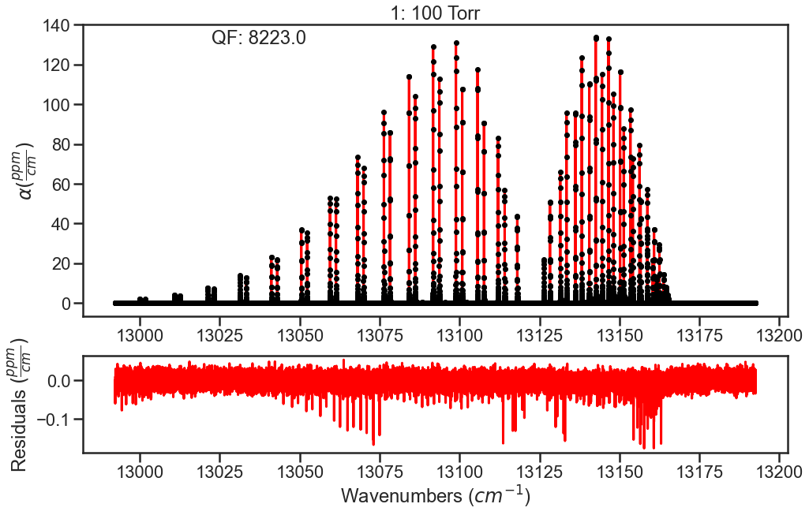
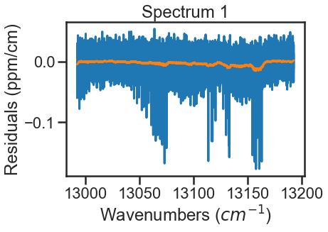
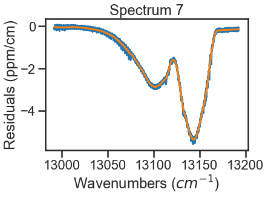
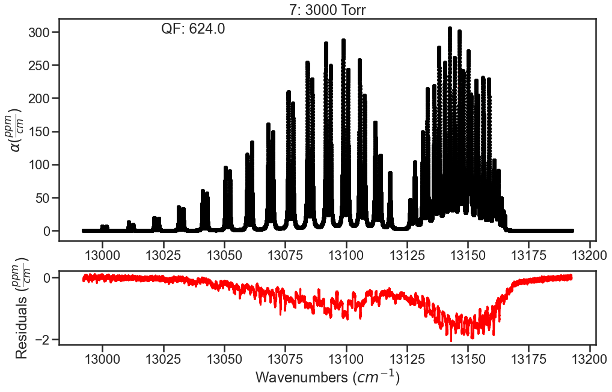

Incorporating CIA into fits
===========================

Provided in the MATS v2 release are several examples highlighting MATS capabilities, which can be found in the MATS `examples folder <https://github.com/usnistgov/MATS/tree/master/MATS/Examples>`_. 

Collision induced absorption (CIA) is a broadband effect stemming from intermolecular interactions leading to a collisionally-induced dipole. Traditionally, CIA is treated as the remaining absorption after modeling baseline and resonant absorption. To accomodate this approach, MATS allows for the input of a static CIA for each spectrum to account for in the fitting solution. `The example <https://github.com/usnistgov/MATS/tree/master/MATS/Examples/Generic_CIA>`_ below takes synthetic spectra that include CIA, evalutates using the initial line list, generates a CIA for each spectrum, and then fits the line shape parameters.

Generate Spectrum Objects
+++++++++++++++++++++++++

Module import follows from the :ref:`Fitting Experimental Spectra` and :ref:`Fitting Synthetic Spectra` examples with additional details on how to simulate spectra found in :ref:`Fitting Synthetic Spectra` and the source documentation.  

The provided spectra were simulated in MATS offline using the `Drouin 2017 Multispectrum analysis of the Oxygen A-Band <https://doi.org/10.1016/j.jqsrt.2016.03.037>`_ line list and also includes the CIA reported in that work. The code below generates :py:class:`Spectrum` objects from these spectra. 

.. code:: ipython3

   path = r'C:\Users\ema3\Documents\MATS\MATS\Examples\Generic_CIA' # Location of the Summary Data File
   os.chdir(path)

   IntensityThreshold = 1e-30 #intensities must be above this value to be simulated
   Fit_Intensity = 1e-26#intensities must be above this value for the line to be fit
   wave_range = 1.5 #range outside of experimental x-range to simulate
   segment_column = None
   etalon = {}
   sample_concentration = {7:  0.209}

   freq_column = 'Wavenumber + Noise (cm-1)'
   tau_column = 'Alpha + LM + CIA'
   pressure_column = 'Pressure (Torr)'
   temp_column = 'Temperature (C)'
   order_baseline_fit = 2

   spec_1 = Spectrum(  '100 Torr', 
                            molefraction = sample_concentration, natural_abundance = True, diluent = 'air', 
                            etalons = etalon, 
                            input_freq = False, frequency_column = freq_column,
                            input_tau = False, tau_column = tau_column, tau_stats_column = None, 
                            pressure_column = pressure_column, temperature_column = temp_column,#segment_column = segment_column, 
                            nominal_temperature = 296, x_shift = 0, baseline_order = order_baseline_fit)
   spec_2 = Spectrum(  '200 Torr', 
                            molefraction = sample_concentration, natural_abundance = True, diluent = 'air', 
                            etalons = etalon, 
                            input_freq = False, frequency_column = freq_column,
                            input_tau = False, tau_column = tau_column, tau_stats_column = None, 
                            pressure_column = pressure_column, temperature_column = temp_column,#segment_column = segment_column, 
                            nominal_temperature = 296, x_shift = 0, baseline_order = order_baseline_fit)
   spec_3 = Spectrum(  '400 Torr', 
                            molefraction = sample_concentration, natural_abundance = True, diluent = 'air', 
                            etalons = etalon, 
                            input_freq = False, frequency_column = freq_column,
                            input_tau = False, tau_column = tau_column, tau_stats_column = None, 
                            pressure_column = pressure_column, temperature_column = temp_column,#segment_column = segment_column, 
                            nominal_temperature = 296, x_shift = 0, baseline_order = order_baseline_fit)
   spec_4 = Spectrum(  '700 Torr', 
                            molefraction = sample_concentration, natural_abundance = True, diluent = 'air', 
                            etalons = etalon, 
                            input_freq = False, frequency_column = freq_column,
                            input_tau = False, tau_column = tau_column, tau_stats_column = None, 
                            pressure_column = pressure_column, temperature_column = temp_column,#segment_column = segment_column, 
                            nominal_temperature = 296, x_shift = 0, baseline_order = order_baseline_fit)
   spec_5 = Spectrum(  '1000 Torr', 
                            molefraction = sample_concentration, natural_abundance = True, diluent = 'air', 
                            etalons = etalon, 
                            input_freq = False, frequency_column = freq_column,
                            input_tau = False, tau_column = tau_column, tau_stats_column = None, 
                            pressure_column = pressure_column, temperature_column = temp_column,#segment_column = segment_column, 
                            nominal_temperature = 296, x_shift = 0, baseline_order = order_baseline_fit)
   spec_6 = Spectrum(  '2000 Torr', 
                            molefraction = sample_concentration, natural_abundance = True, diluent = 'air', 
                            etalons = etalon, 
                            input_freq = False, frequency_column = freq_column,
                            input_tau = False, tau_column = tau_column, tau_stats_column = None, 
                            pressure_column = pressure_column, temperature_column = temp_column,#segment_column = segment_column, 
                            nominal_temperature = 296, x_shift = 0, baseline_order = order_baseline_fit)
   spec_7 = Spectrum(  '3000 Torr', 
                            molefraction = sample_concentration, natural_abundance = True, diluent = 'air', 
                            etalons = etalon, 
                            input_freq = False, frequency_column = freq_column,
                            input_tau = False, tau_column = tau_column, tau_stats_column = None, 
                            pressure_column = pressure_column, temperature_column = temp_column,#segment_column = segment_column, 
                            nominal_temperature = 296, x_shift = 0, baseline_order = order_baseline_fit)

   
Generate Dataset
++++++++++++++++
A line list generated from the Drouin 2017 Oxygen A-Band data combined with HITRAN 2016 values is used as the initial guess.  A similar line list was used in the generation of the spectra, with truncation errors being the most like cause of discrepencies.  Spectra are combined to form a :py:class:`Dataset` object.

.. code:: ipython3

   #Put Together Dataset
   linelist = r'C:\Users\ema3\Documents\MATS\MATS\Linelists' # Location of the Summary Data File
   os.chdir(linelist)
   PARAM_LINELIST = pd.read_csv('O2_ABand_Drouin_2017_linelist.csv')

   os.chdir(path)

   SPECTRA = Dataset([spec_1, spec_2, spec_3, spec_4, spec_5, spec_6, spec_7], 'CIA Spectra Study', PARAM_LINELIST) 

   #Generate Baseline Parameter list based on number of etalons in spectra definitions and baseline order
   BASE_LINELIST = SPECTRA.generate_baseline_paramlist()
   
Evaluation
++++++++++
Inital fit doesn't float any parameters.  The residual plots shown are only for the lowest and highest pressures.  In the high pressure residuals, you can see that the unaccounted for CIA is dominating the residuals and wouldn't allow for optimization of line shape parameters without treatment.

.. code:: ipython3

   FITPARAMS = Generate_FitParam_File(SPECTRA, PARAM_LINELIST, BASE_LINELIST,
                                   lineprofile = 'SDVP', linemixing = True, 
                                      fit_intensity = Fit_Intensity, threshold_intensity = Fit_Intensity, 
                                      nu_constrain = True, sw_constrain = True, gamma0_constrain = True, delta0_constrain = True, 
                                       aw_constrain = True, as_constrain = True, 
                                       nuVC_constrain = True, eta_constrain =True, linemixing_constrain = True)

   FITPARAMS.generate_fit_param_linelist_from_linelist(vary_nu = {7:{1:False, 2:False, 3:False}}, vary_sw = {7:{1:False, 2:False, 3:False}},
                                                    vary_gamma0 = {7:{1: False, 2:False, 3: False}}, vary_n_gamma0 = {7:{1:False}}, 
                                                    vary_delta0 = {7:{1: False, 2:False, 3: False}}, vary_n_delta0 = {7:{1:False}}, 
                                                    vary_aw = {7:{1: False, 2:False, 3: False}}, vary_n_gamma2 = {7:{1:False}}, 
                                                    vary_as = {7:{1:False}}, vary_n_delta2 = {7:{1:False}}, 
                                                    vary_nuVC = {7:{1:False}}, vary_n_nuVC = {7:{1:False}},
                                                    vary_eta = {}, vary_linemixing = {7:{1:False}})

   FITPARAMS.generate_fit_baseline_linelist(vary_baseline = False, vary_molefraction = {7:False, 1:False}, vary_xshift = False, 
                                      vary_etalon_amp= False, vary_etalon_period= False, vary_etalon_phase= False)

   fit_data = Fit_DataSet(SPECTRA,'Baseline_LineList', 'Parameter_LineList',
                       minimum_parameter_fit_intensity = Fit_Intensity)
   params = fit_data.generate_params()
    

   result = fit_data.fit_data(params, wing_wavenumbers = 50, wing_method = 'wing_wavenumbers', xtol = 1e-7, maxfev = 2000, ftol = 1e-7)

   fit_data.residual_analysis(result, indv_resid_plot=True)
   fit_data.update_params(result)
   SPECTRA.generate_summary_file(save_file = True)

.. image:: example_files/CIA_high.png

.. currentmodule:: Spectrum 

A simple function is defined to  treat the CIA as the smooth residuals.  To do this we will use a filter to smooth over any resonant absorbance and then define the CIA as the negative of what is leftover.  This is done for all spectra making up the dataset.  Note that this defininition includes the :py:func:`Spectrum.set_cia` function to assign this array to a given :py:class:`Spectrum` instance.  Again the plots below show this process for the lowest and highest pressure spectra, where the blue lines are the residuals and the orange lines are the smoothed residuals that will define the magnitude of the CIA.  

.. code:: ipython3

   from scipy.signal import savgol_filter

   def ad_hoc_CIA(spec):
    
    waves = spec.wavenumber
    resds = spec.residuals

    CIA = savgol_filter(resds, 501, 1) # Savitsky Golay Filte that uses a 501 pt sliding window with a first order polynomial to smooth the data.  These settings were arbitrary to smooth out the data.
    plt.plot(waves, resds)
    plt.plot(waves, CIA)
    plt.xlabel('Wavenumbers ($cm^{-1}$)')
    plt.ylabel('Residuals (ppm/cm)')
    plt.title( 'Spectrum '+ str(spec.spectrum_number))
    plt.show()
    spec.set_cia(-1*CIA)
   ad_hoc_CIA(spec_1)
   ad_hoc_CIA(spec_2)
   ad_hoc_CIA(spec_3)
   ad_hoc_CIA(spec_4)
   ad_hoc_CIA(spec_5)
   ad_hoc_CIA(spec_6)
   ad_hoc_CIA(spec_7)
   

The spectra are evaluated again and we see that the residuals have improved.  To further improve fits, I would optimize line parameters in small wavenumber sections using the baseline parameter to account for remaining CIA.  These line shape parameters  could then be used in evaluation of the full band (like above) and then the CIA column could be ammended based on those results.  Iterating on these steps should allow for optimization of both the line shape parameters and the CIA.

.. code:: ipython3
   fit_data = Fit_DataSet(SPECTRA,'Baseline_LineList', 'Parameter_LineList',
                       minimum_parameter_fit_intensity = Fit_Intensity)
   params = fit_data.generate_params()
   result = fit_data.fit_data(params, wing_wavenumbers = 25, wing_method = 'wing_cutoff', xtol = 1e-7, maxfev = 2000, ftol = 1e-7)
   fit_data.residual_analysis(result, indv_resid_plot=True)
   fit_data.update_params(result)
   SPECTRA.generate_summary_file(save_file = True)
 
.. image:: example_files/CIA_low_2.png

