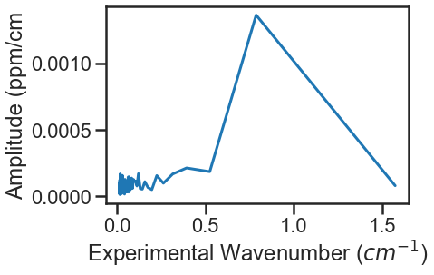

MATS Example using Experimental and Synthetic Data
===================================================

Provided in the MATS v1.0 release are two examples using MATS in the Oxygen A-Band.  The first uses `experimental spectra <https://github.com/usnistgov/MATS/tree/master/MATS/Examples/A-Band%20-%20Experimental%20Spectra>`_ and the second uses `synthetic spectra <https://github.com/usnistgov/MATS/tree/master/MATS/Examples/A-Band%20-%20Synthetic%20Spectra>`_.  In this overview, we will walk through the common elements of both examples and highlight the differences between using experimental data and simulated spectra generated through the :py:func:`MATS.simulate_spectrum` function.  

Import Modules and Set-Up
+++++++++++++++++++++++++
Both examples start with importing modules and setting up file locations

.. code:: ipython3

   import numpy as np
   import pandas as pd
   import qgrid # only need if using the edit MATS.Edit_Fit_Param_Files class
   import os, sys
   import matplotlib.pyplot as plt
   from matplotlib import gridspec

Append the system path to include the location of both the hapi and MATS modules

.. code:: ipython3

   sys.path.append(r'C:\Users\Documents\MATS\MATS')# set location of HAPI.py module

   from hapi import *
   from MATS import *
  
Change the path to the working directory that contains experimental spectra or the file that you want to work in.

.. code:: ipython3

   path = r'C:\Users\Documents\MATS\MATS\Examples\A-Band - Experimental Spectra'
   os.chdir(path)
  
 
   
Load Spectra from files
+++++++++++++++++++++++
There are two options for generating :py:class:`MATS.Spectrum` objects.  The first is from a file by instantiating an instance of the class.  The second option is by using the :py:func:`MATS.simulate_spectrum` function described in the following section.  

Before generating :py:class:`MATS.Spectrum` objects from your experimental data, it is helpful to set some variables for terms that will be used in all of the spectrum objects or throughout the fitting.  In this example the minimum intensity threshold for simulation (IntensityThreshold), the minimum line intensity of lines  fit in the analysis (Fit_Intensity), the order of the polynomial used in the baseline fits, and the names of columns used for the absorption, frequency, pressure, and temperature data are defined at the top of the example.

.. code:: ipython3

   wave_range = 1.5 #range outside of experimental x-range to simulate
   IntensityThreshold = 1e-30 #intensities must be above this value to be simulated
   Fit_Intensity = 1e-24 #intensities must be above this value for the line to be fit
   order_baseline_fit = 1
   tau_column = 'Corrected Tau (us)' # Mean tau/us
   freq_column = 'Total Frequency (Detuning)' # Total Frequency /MHz
   pressure_column = 'Cavity Pressure /Torr'
   temperature_column = 'Cavity Temperature Side 2 /C'

After that 4 instances of the :py:class:`MATS.Spectrum` class are instantiated from 4 experimental spectra.  In the class instantiation, the mole fraction of the oxygen sample used is defined, the etalon amplitude and period are defined, the sample is confirmed to be at natural abundance, the diluent is set to air, and the columns defined for pressure, temperature, frequency, and absorbance data are set.  

.. code:: ipython3

   spec_1 = Spectrum('190510_2per_43_forfit', 
                        molefraction = { 7 :0.01949}, natural_abundance = True, diluent = 'air', 
                        etalons = {1:[0.001172, 1.19574]}, 
                        input_freq = True, frequency_column = freq_column,
                        input_tau = True, tau_column = tau_column, tau_stats_column = None, 
                        pressure_column = pressure_column, temperature_column = temperature_column, 
                        nominal_temperature = 296, x_shift = 0.00)
   spec_2 = Spectrum('190510_2per_55_forfit', 
                        molefraction = { 7 : 0.01949}, natural_abundance = True, diluent = 'air', 
                        etalons = {1:[0.001172, 1.19574]}, 
                        input_freq = True, frequency_column = freq_column,
                        input_tau = True, tau_column = tau_column, tau_stats_column = None, 
                        pressure_column = pressure_column, temperature_column = temperature_column, 
                        nominal_temperature = 296, x_shift = 0.00)
   spec_3 = Spectrum('190513_2per_82_forfit', 
                        molefraction = { 7 :0.01949}, natural_abundance = True, diluent = 'air', 
                        etalons = {1:[0.001172, 1.19574]}, 
                        input_freq = True, frequency_column = freq_column,
                        input_tau = True, tau_column = tau_column, tau_stats_column = None, 
                        pressure_column = pressure_column, temperature_column = temperature_column, 
                        nominal_temperature = 296, x_shift = 0.00)
   spec_4 = Spectrum('190514_2per_126_forfit', 
                        molefraction = { 7 :0.01949}, natural_abundance = True, diluent = 'air', 
                        etalons = {1:[0.001172, 1.19574]}, 
                        input_freq = True, frequency_column = freq_column,
                        input_tau = True, tau_column = tau_column, tau_stats_column = None, 
                        pressure_column = pressure_column, temperature_column = temperature_column, 
                        nominal_temperature = 296, x_shift = 0.00)

The :py:func:`MATS.Spectrum.plot_wave_alpha` function is called to plot a spectrum.

.. code:: ipython3

   spec_1.plot_wave_alpha()
   
.. image:: example_files/plot_wave_alpha.png  

Simulate Spectra
++++++++++++++++
If you are simulating spectra, opposed to reading them in from a file, then you can use the :py:func:`MATS.simulate_spectrum` function.

When simulating spectra, the first step is to read in the reference line list.  The following code reads in the reference line list as a pandas dataframe, then resets the working directory,

.. code:: ipython3

   hapi = r'C:\Users\Documents\MATS\MATS\Linelists'
   os.chdir(hapi)
   PARAM_LINELIST = pd.read_csv('O2_ABand_Drouin_2017_linelist.csv')

   path = r'C:\Users\Documents\MATS\MATS\Examples\A-Band - Synthetic Spectra'
   os.chdir(path)   

Just as you would do if reading in the experimental spectrum, this example defines some common simulation and fit variables.  In addition to variables defined above, the minimum and maximum wavenumbers for the simulation and the simulation wavenumber spacing are defined.  The baseline (defined by a polynomial where the array index is the parameter coefficient order).  

.. code:: ipython3

   wave_range = 1.5 #range outside of experimental x-range to simulate
   IntensityThreshold = 1e-30 #intensities must be above this value to be simulated
   Fit_Intensity = 1e-24 #intensities must be above this value for the line to be fit
   order_baseline_fit = 1
   sample_molefraction = {7 :0.002022}
   wave_min = 13155 #cm-1
   wave_max = 13157.5 #cm-1
   wave_space = 0.005 #cm-1
   baseline_terms = [0] #polynomial baseline coefficients where the index is equal to the coefficient order  
   

The :py:func:`MATS.simulate_spectrum` function also allows for error to be added:

* to the absorption axis through SNR.  The SNR is implemented by adding  gaussian noise to the spectra such that the (maximum alpha - minimum alpha) / noise is equal to the SNR.
* to the wavenumber axis through the wave_err parameter.  The wavenumber err is a gaussian noise error of the specified magnitude added to the wavenumber axis.  
* to the mole fraction through the molefraction_err parameter.  The molefraction_err is implemented as a percent error bias on each molecule molefraction, such that the simulated value is off by a constant positve offset from the simulated value(could enter negative percent error to get negative offset).  This mimics the maximum impact that a constant error in sample mole fraction would have.  
* to the temperature/pressure through the temperature_err and pressure_err dictionaries.  In experiments there are generally two type of errors with pressure and temperature measurements.  The first is a constant bias in the reading.  The second type of error is an actual change in the pressure/temperature during the collection of the spectrum.  To account for both error types the pressure_err and temperature_err are dictionaries, where the keys correspond to 'bias/per_bias' (bias for temperature and per_bias for pressure), function (allows 'linear' or 'sine') and params.  If the function is 'linear' then param keys are 'm' and 'b' corresponding to the slope and interecept. If the function is 'sine' then the param keys are 'amp', 'freq', and 'phase' corresponding to the amplitude, period, and phase of the etalon.  For both temperature and pressure, the pressure/temperature recorded in the simulated spectra output include the average pressure or temperature over the segment (representing the frequency of the pressure/temperature measurement in an experiment) and does not include the bias in pressure/temperature as this is an unknown.  

.. code:: ipython3

   SNR = 10000
   wave_error = 5e-5
   temperature_err =  {'bias': 0.01, 'function': None, 'params': {}}  
   pressure_err = {'per_bias': 0.01, 'function': None, 'params': {}}
   molefraction_err = {7:0.01}

These parameters and the additional settings for filenames and number of segments can be used to call the :py:func:`MATS.simulate_spectrum` function setting the output equal to the variables as was done when the :py:class:`MATS.Spectrum` was used.  This makes it simple to transition code from analysis of experimental spectra to error analysis through simulations.  

.. code:: ipython3   
   
   spec_1 =  simulate_spectrum(PARAM_LINELIST, wave_min, wave_max, wave_space, wave_error = wave_error, 
                        SNR = SNR, baseline_terms = baseline_terms, temperature = 25, temperature_err = temperature_err, pressure = 20, 
                        pressure_err = pressure_err, 
                        wing_cutoff = 50,  wing_method = 'wing_cutoff', filename = '20_torr', molefraction = sample_molefraction, molefraction_err = molefraction_err,
                        natural_abundance = True, nominal_temperature = 296, IntensityThreshold = 1e-30, num_segments = 1)
   spec_2 =  simulate_spectrum(PARAM_LINELIST, wave_min, wave_max, wave_space, wave_error = wave_error, 
                        SNR = SNR, baseline_terms = baseline_terms, temperature = 25, temperature_err = temperature_err, pressure = 40, 
                        pressure_err = pressure_err, 
                        wing_cutoff = 50,  wing_method = 'wing_cutoff', filename = '40_torr', molefraction = sample_molefraction, molefraction_err = molefraction_err,
                        natural_abundance = True, nominal_temperature = 296, IntensityThreshold = 1e-30, num_segments = 1)
   spec_3 =  simulate_spectrum(PARAM_LINELIST, wave_min, wave_max, wave_space, wave_error = wave_error, 
                        SNR = SNR, baseline_terms = baseline_terms, temperature = 25, temperature_err = temperature_err, pressure = 60, 
                        pressure_err = pressure_err, 
                        wing_cutoff = 50,  wing_method = 'wing_cutoff', filename = '60_torr', molefraction = sample_molefraction, molefraction_err = molefraction_err,
                        natural_abundance = True, nominal_temperature = 296, IntensityThreshold = 1e-30, num_segments = 1)
   spec_4 =  simulate_spectrum(PARAM_LINELIST, wave_min, wave_max, wave_space, wave_error = wave_error, 
                        SNR = SNR, baseline_terms = baseline_terms, temperature = 25, temperature_err = temperature_err, pressure = 80, 
                        pressure_err = pressure_err, 
                        wing_cutoff = 50,  wing_method = 'wing_cutoff', filename = '80_torr', molefraction = sample_molefraction, molefraction_err = molefraction_err,
                        natural_abundance = True, nominal_temperature = 296, IntensityThreshold = 1e-30, num_segments = 1)

Generate a Dataset
++++++++++++++++++
The procedure for analysis for both spectrum class generation methods illustrated above is the same from this point on.  The next step is to combine all spectrum objects for analysis into a :py:class:`MATS.Dataset` object, where we give the dataset a name.  The order of polynomial to use for the baseline fit is also defined.

.. code:: ipython3

   SPECTRA = Dataset([spec_1, spec_2, spec_3, spec_4], 'Line Intensity', baseline_order = order_baseline_fit)
   
The :py:class:`MATS.Dataset` class contains a function to generate a baseline linelist analogous to the one for the parameter line list done outside of this example based on the order of the baseline fit, etalons, molecules, x-shift parameters, and segments as defined by both the spectrum and dataset objects.

.. code:: ipython3

   BASE_LINELIST = SPECTRA.generate_baseline_paramlist()

If the parameter line list hasn't been read in from the .csv file, then do that now making sure to switch to the appropriate directories as needed.

.. code:: ipython3

   hapi = r'C:\Users\Documents\MATS\MATS\Linelists'
   os.chdir(hapi)
   PARAM_LINELIST = pd.read_csv('O2_ABand_Drouin_2017_linelist.csv')
   os.chdir(path)
   
Generate Fit Parameter Files
++++++++++++++++++++++++++++
The next section of code uses the :py:class:`MATS.Generate_FitParam_File` class to define what line shape to use for the initial fits, whether to use line mixing, the minimum line intensity to fit a line, mimimum intensity to included in the simulation, and for each line parameter whether that parameter is going to be constrained across all spectra or whether there will be a parameter for each spectrum (multi-spectrum vs single-spectrum fits) on a parameter by parameter basis.  In the example below, the SDVP line profile without line mixing will be used to fit lines with line intensities greater than 1e-24 and the line centers and line intensities will be allowed to float for each line, while all other lines are constrained across all spectra in the dataset.

.. code:: ipython3

   FITPARAMS = Generate_FitParam_File(SPECTRA, PARAM_LINELIST, BASE_LINELIST, lineprofile = 'SDVP', linemixing = False, 
                                  fit_intensity = Fit_Intensity, threshold_intensity = IntensityThreshold, sim_window = wave_range,
                                  nu_constrain = False, sw_constrain = False, gamma0_constrain = True, delta0_constrain = True, 
                                   aw_constrain = True, as_constrain = True, 
                                   nuVC_constrain = True, eta_constrain =True, linemixing_constrain = True)

The next step is to generate fit parameter and baseline line lists that include columns that specify whether that parameter should be varied during fitting, in addition to adding error columns for the fit error in that parameter.  For the following example the line centers, line intensities, collisional half-widths, and aw terms will be floated for all main oxygen isotopes for lines where the line intensity is greater than 1e-24.  Additionally, the baseline terms will float, as will the etalon amplitude and phase.  

.. code:: ipython3

   FITPARAMS.generate_fit_param_linelist_from_linelist(vary_nu = {7:{1:True, 2:False, 3:False}}, vary_sw = {7:{1:True, 2:False, 3:False}},
                                                    vary_gamma0 = {7:{1: True, 2:False, 3: False}, 1:{1:False}}, vary_n_gamma0 = {7:{1:True}}, 
                                                    vary_delta0 = {7:{1: False, 2:False, 3: False}, 1:{1:False}}, vary_n_delta0 = {7:{1:True}}, 
                                                    vary_aw = {7:{1: True, 2:False, 3: False}, 1:{1:False}}, vary_n_gamma2 = {7:{1:False}}, 
                                                    vary_as = {}, vary_n_delta2 = {7:{1:False}}, 
                                                    vary_nuVC = {7:{1:False}}, vary_n_nuVC = {7:{1:False}},
                                                    vary_eta = {}, vary_linemixing = {7:{1:False}})

   FITPARAMS.generate_fit_baseline_linelist(vary_baseline = True, vary_molefraction = {7:False, 1:False}, vary_xshift = False, 
                                      vary_etalon_amp= True, vary_etalon_freq= False, vary_etalon_phase= True)   

These functions will generate .csv files corresponding to these selections, which are read in by the :py:class:`MATS.Fit_DataSet` class instantiation.  This means that edits can be made manually to the .csv files or using the :py:class:`MATS.Edit_Fit_Param_Files` class before the next code segment is run.

Fit Dataset
+++++++++++
Instantiating the :py:class:`MATS.Fit_DataSet` class reads in the information from the baseline and parameter linelists generated in the previous step.  It also allows for limits to be placed on the parameters, so that they don't result in divergent solutions.  The example below includes several limits including limiting the line center to be within 0.1 cm-1 of the initial guess and the Line intensity to be within a factor of 2 of the intial guess.  Placing limits on the parameters can be restrictive on the solution and cause the fit to not converge or return NaN for the standard error if it doesn't allow for a local minima to be found. 

.. code:: ipython3

   fit_data = Fit_DataSet(SPECTRA,'Baseline_LineList', 'Parameter_LineList', minimum_parameter_fit_intensity = Fit_Intensity, 
                baseline_limit = False, baseline_limit_factor = 10, 
                molefraction_limit = True, molefraction_limit_factor = 1.1, 
                etalon_limit = False, etalon_limit_factor = 2, #phase is constrained to +/- 2pi, 
                x_shift_limit = True, x_shift_limit_magnitude = 0.5, 
                nu_limit = True, nu_limit_magnitude = 0.1, 
                sw_limit = True, sw_limit_factor = 2, 
                gamma0_limit = True, gamma0_limit_factor = 3, n_gamma0_limit= False, n_gamma0_limit_factor = 50, 
                delta0_limit = True, delta0_limit_factor = 2, n_delta0_limit = False, n_delta0_limit_factor = 50, 
                SD_gamma_limit = True, SD_gamma_limit_factor = 2, n_gamma2_limit = False, n_gamma2_limit_factor = 50, 
                SD_delta_limit = True, SD_delta_limit_factor = 50, n_delta2_limit = False, n_delta2_limit_factor = 50, 
                nuVC_limit = False, nuVC_limit_factor = 2, n_nuVC_limit = False, n_nuVC_limit_factor = 50, 
                eta_limit = True, eta_limit_factor = 50, linemixing_limit = False, linemixing_limit_factor = 50)
   

The next step is to generate the lmfit params dictionary object through the :py:func:`MATS.Fit_DataSet.generate_params` function.  This translates baseline and parameter linelist .csv files into the lmfit parameter dictionary that is used in the fits.  After the parameters object is generated you can use the keys to set values and impose constraints on individual parameters, if desired.  While this is not coded in the MATS toolkit, it is incredibly powerful as it lets you define min, max, vary, and expression values for any parameter.  In the example below, two additional constraints are imposed on specific fit parameters the first constrains all aw parameters to be between the values of 0.01 and 0.25 and the second forces the amplitude of the etalon to be constant across all spectra.  

.. code:: ipython3

   params = fit_data.generate_params()

   for param in params:
		if 'SD_gamma' in param:
			params[param].set(min = 0.01, max = 0.25)
		if 'etalon_1_amp' in param:
			if param != 'etalon_1_amp_1_1':
				params[param].set(expr='etalon_1_amp_1_1')

The params file is then used to fit the spectra in the dataset using the :py:func:`MATS.Fit_DataSet.fit_data` function, where the result is a lmfit result object. The lmft prettyprint function prints the parameter fit results.  Included below is an abbreviated prettyprint output that not only shows the fit result values and stderr, but also highlights that constraints were imposed on the SD_gamma parameters and an expression was imposed on the etalon_amplitudes.  It also shows that the there is a line intensity reported for every line (suffix number) and spectrum (after sw_) as the line intensities were not constrained to global fits.  The sw reportes shows that the fitted line intensity value is scaled by the minimum fit value.  This aids in the fitting as line intensities are so much smaller than other values.  

.. code:: ipython3

   result = fit_data.fit_data(params, wing_cutoff = 25)
   print (result.params.pretty_print())
   
.. parsed-literal:: 
   
   Name                     Value      Min      Max   Stderr     Vary     Expr Brute_Step
   Pressure_1_1           0.07911     -inf      inf        0    False     None     None
   Pressure_2_1           0.06556     -inf      inf        0    False     None     None
   Pressure_3_1           0.04602     -inf      inf        0    False     None     None
   Pressure_4_1           0.02488     -inf      inf        0    False     None     None
   SD_delta_air_line_1          0     -inf      inf        0    False     None     None   
   SD_delta_air_line_10         0     -inf      inf        0    False     None     None
   SD_delta_air_line_13         0     -inf      inf        0    False     None     None
   SD_delta_air_line_25         0     -inf      inf        0    False     None     None
   SD_delta_air_line_26         0     -inf      inf        0    False     None     None
   SD_gamma_air_line_1        0.1     0.01     0.25        0    False     None     None
   SD_gamma_air_line_10    0.1137     0.01     0.25 0.0008273     True     None     None
   SD_gamma_air_line_13    0.1313     0.01     0.25 0.001115     True     None     None
   SD_gamma_air_line_25      0.09     0.01     0.25        0    False     None     None
   SD_gamma_air_line_26       0.1     0.01     0.25        0    False     None     None
   . . . 
   etalon_1_amp_1_1      0.001762     -inf      inf 4.007e-05     True     None     None
   etalon_1_amp_2_1      0.001762     -inf      inf 4.007e-05    False etalon_1_amp_1_1     None
   etalon_1_amp_3_1      0.001762     -inf      inf 4.007e-05    False etalon_1_amp_1_1     None
   etalon_1_amp_4_1      0.001762     -inf      inf 4.007e-05    False etalon_1_amp_1_1     None
   etalon_1_freq_1_1        1.196     -inf      inf        0    False     None     None
   etalon_1_freq_2_1        1.196     -inf      inf        0    False     None     None
   etalon_1_freq_3_1        1.196     -inf      inf        0    False     None     None
   etalon_1_freq_4_1        1.196     -inf      inf        0    False     None     None
   etalon_1_phase_1_1     -0.3479     -inf      inf  0.04585     True     None     None
   etalon_1_phase_2_1    -0.09384     -inf      inf  0.04288     True     None     None
   etalon_1_phase_3_1       -1.04     -inf      inf  0.04446     True     None     None
   etalon_1_phase_4_1      -1.266     -inf      inf  0.04394     True     None     None 
   gamma0_air_line_1         0.04     -inf      inf        0    False     None     None
   gamma0_air_line_10     0.04501     -inf      inf 4.919e-05     True     None     None
   gamma0_air_line_13     0.04339     -inf      inf 7.531e-05     True     None     None
   gamma0_air_line_25        0.04     -inf      inf        0    False     None     None
   gamma0_air_line_26        0.04     -inf      inf        0    False     None     None
   . . . 
   sw_1_line_1              4.369    2.184    8.738        0    False     None     None
   sw_1_line_10             4.735      2.4    9.598 0.0008558     True     None     None
   sw_1_line_13             3.087    1.562    6.246 0.0007302     True     None     None
   sw_1_line_25             2.083    1.042    4.166        0    False     None     None
   sw_1_line_26             3.399    1.699    6.798        0    False     None     None
   sw_2_line_1              4.369    2.184    8.738        0    False     None     None
   sw_2_line_10             4.752      2.4    9.598 0.0006929     True     None     None
   sw_2_line_13             3.091    1.562    6.246 0.0006913     True     None     None
   sw_2_line_25             2.083    1.042    4.166        0    False     None     None
   sw_2_line_26             3.399    1.699    6.798        0    False     None     None
   sw_3_line_1              4.369    2.184    8.738        0    False     None     None
   sw_3_line_10             4.744      2.4    9.598 0.0007446     True     None     None
   sw_3_line_13             3.095    1.562    6.246 0.0007499     True     None     None
   sw_3_line_25             2.083    1.042    4.166        0    False     None     None
   sw_3_line_26             3.399    1.699    6.798        0    False     None     None
   sw_4_line_1              4.369    2.184    8.738        0    False     None     None
   sw_4_line_10               4.8      2.4    9.598 0.001158     True     None     None
   sw_4_line_13             3.118    1.562    6.246  0.00117     True     None     None
   sw_4_line_25             2.083    1.042    4.166        0    False     None     None
   sw_4_line_26             3.399    1.699    6.798        0    False     None     None

The last segment of code provides residual plots and updates residuals through the :py:func:`MATS.fit_data.residual_analysis` and :py:func:`MATS.Dataset.plot_model_residuals` functions, updates the parameter and baseline line lists :py:func:`MATS.fit_data.update_params`, and generates a summary file with the fit results :py:func:`MATS.Dataset.plot_model_residuals`.

.. code:: ipython3

   fit_data.residual_analysis(result, indv_resid_plot=True)
   fit_data.update_params(result)
   SPECTRA.generate_summary_file(save_file = True)
   SPECTRA.plot_model_residuals()

.. image:: example_files/spectra_residuals.png  

At the bottom of the experimental spectra example there is call to the :py:func:`MATS.Spectrum.fft_spectrum` function.  If we hadn't included the etalon the fit residuals would look like this:

.. image:: example_files/spectra_residuals_noetalon.png  

Calling the :py:func:`MATS.Spectrum.fft_spectrum` function on these residuals gives the following result with the most abundant period being 1.271443 cm-1 and an amplitude of 0.001364.  The more periods present in the spectral region being fit the more precise the etalon amplitude and frequency will be.

Using these values as the etalon period and amplitude give the fit residuals shown above and when incorporated the FFT no longer shows a substantial peak at 1.271443 cm-1.

.. image:: example_files/etalon_FFT.png  

